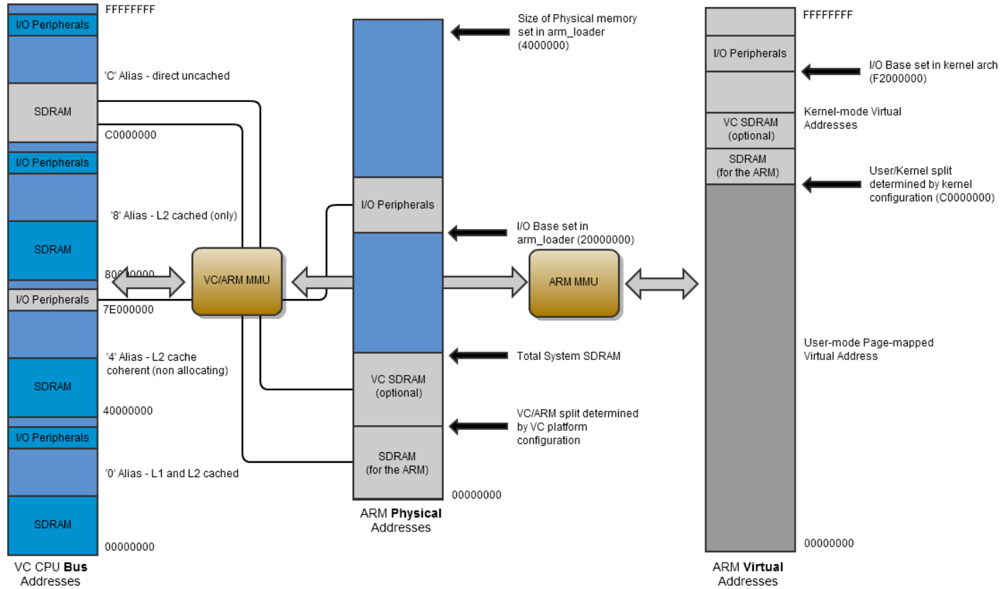

# Fundamental concepts

BCM2835 contains the following peripherals which may safely be accessed by the ARM:

* Timers
* Interrupt controller
* GPIO
* USB
* PCM / I2S
* DMA controller
* I2C master
* I2C / SPI slave
* SPI0, SPI1, SPI2
* PWM
* UART0, UART1 



Addresses in ARM Linux are:
* issued as virtual addresses by the ARM core, then
* mapped into a physical address by the ARM MMU, then
* mapped into a bus address by the ARM mapping MMU, and finally
* used to select the appropriate peripheral or location in RAM. 

Bus address for peripherals advertised inside the official document like BCM2835, BCM2837 (e.g ``0x7E000000``) are mapped into the physical address (e.g: physical address starting at ``0x20000000`` for BCM2835, ``0x3f000000`` for BCM2837). Thus a peripheral advertised here at bus address ``0x7Ennnnnn`` is available at physical address ``0x20nnnnnn``. 

# Implementations

## devmem

``busybox devmem`` is a tiny CLI utility (in busybox) that does ``mmap()`` in ``/dev/mem``.

``devmem`` will read 4 bytes (by default) from the physical address.

E.g: Read 4 bytes from physical address ``0x12345678``

```sh
sudo busybox devmem 0x12345678
```

### Blink LED on GPIO 03 by devmem

```sh
sudo busybox devmem 0x3f200000 w 0x200 	#Set output for GPIO 3
sudo busybox devmem 0x3f20001c w 0x8	#Turn ON GPIO 3 
sudo busybox devmem 0x3f200028 w 0x8	#Turn OFF GPIO 3
```

In this case, the register address are handled by their real value, so the register incremented in those operations are multiple by ``4``, that related to [the + arithmetic issue in C](https://github.com/TranPhucVinh/C/tree/master/Physical%20layer/Memory/Pointer#-arithmetic-issue).

```
0x3f200000: output register address
0x3f20001c = 0x3f200000  + 7*4;
0x3f200028 = 0x3f200000 + 10*4;
```

### Working with ``devmem`` based on the virtual memory achieved by``iowrite32()`` operations

Kernel module program that setup output for GPIO and also print out the physical address and written value for later testing with ``devmem``:

```c
#include <linux/module.h>
#include <linux/kernel.h>
#include <linux/io.h>

#define BCM2837_PHY_ADDR                0x3f000000 //BCM2837 physical address start
#define GPIO_BASE                       (BCM2837_PHY_ADDR + 0x200000) /* GPIO controller */

#define LED			3

#define MAPPING_SIZE            0x100

MODULE_LICENSE("GPL");

unsigned int *gpio_base;

unsigned int *led_vir_address;

unsigned long led_phy_address;

unsigned long led_output_value = 0;//led_output_value to setup output mode, read, write operation

int init_module(void)
{
	printk(KERN_INFO "Hello, World !\n");

	//Memory mapping
	gpio_base = (unsigned int *)ioremap(GPIO_BASE, MAPPING_SIZE);
	if (gpio_base == NULL) printk("Couldn't perform mapping\n");
	else {
		led_phy_address = GPIO_BASE + LED/10;

		//Set virtual address for LED pin as the mapping with mmap()/ioremap() is linear
		led_vir_address = gpio_base + LED/10;

		//Set GPIO output
        led_output_value = ioread32(led_vir_address);
		led_output_value  &= ~(7<<(((LED)%10)*3));
		led_output_value |= (1<<(((LED)%10)*3));

		iowrite32(led_output_value, led_vir_address); //Set LED output

		printk("GPIO LED physical address 0x%lx\n", led_phy_address);//0x3f200000
		printk("GPIO LED virtual address 0x%p\n", led_vir_address);//0xdf1e40bc

		//Use hex value %x for easier comparing with devmem
		printk("led_output_value 0x%lx\n", led_output_value);//0x200
	}
		
	return 0;
}

void cleanup_module(void)
{
	printk(KERN_INFO "clean up module\n");
	iounmap(gpio_base);
}
```

To check ``iowrite32(led_output_value, led_vir_address)``'s operation, use ``devmem`` for ``led_phy_address`` (GPIO LED physical address):

```sh
sudo busybox devmem 0x3f200000
```

This will return ``0x00000200``

Set output for LED with busy box

```sh
sudo busybox devmem 0x3f200000 w 0x00000200
```

## mmap()

Use [virtual memory function mmap()](https://github.com/TranPhucVinh/C/blob/master/Physical%20layer/Memory/Virtual%20memory.md#mmap) to read physical address value:

**Step 1**: Perform the memory mapping from physical to virtual address

**Step 2**: Read that physical address storage value by ``*`` operator in the mapped virtual address.

### Example

Read the value stored in physical address ``PHY_ADDR``:

```c
#include <stdio.h>
#include <stdlib.h>
#include <fcntl.h>
#include <sys/mman.h>
#include <stdint.h>
#include <unistd.h>

#define PHY_ADDR    0x3f20000

uint32_t *gpio;

int main(int argc, char **argv)
{
    int fd ;
    uint32_t* mapping_address;
    /*
            open /dev/mem as a bridge for MMU mapping
            from the physical addresses to virtual address
    */
    if ((fd = open("/dev/mem", O_RDWR | O_SYNC) ) < 0) {
            printf("Unable to open /dev/mem: \n");
            return 0;
    }

    printf("open /dev/mem successfully\n");

    //mapping  GPIO base physical address to a virtual address
    mapping_address = (uint32_t *)mmap(NULL, 4048, PROT_READ|PROT_WRITE, MAP_SHARED, fd, PHY_ADDR);

    if ((intptr_t)mapping_address < 0){
            printf("mmap failed: \n");
            return 0;
    }
    printf("mmap ok \n");
    close(fd);

    printf("0x%x\n", *mapping_address);//Read value stored in physcial address PHY_ADDR
}
```
